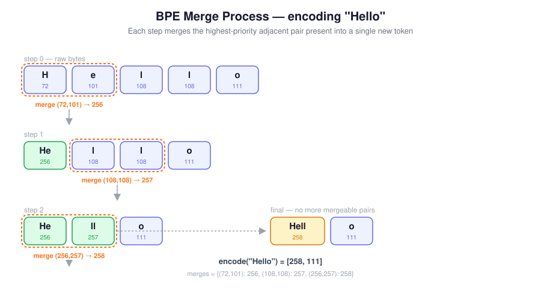

# cminbpe

A minimal byte-pair encoding (BPE) tokenizer, extending Karpathy's [minbpe](https://github.com/karpathy/minbpe) reference implementation with a C-accelerated core. Training and encoding run as native extensions; the Python layer stays thin and readable.

[](LICENSE)

## Why

`minbpe` is deliberately minimal and easy to read, which makes it a great reference — but pure-Python BPE training is slow on anything beyond toy corpora. `cminbpe` keeps the exact same algorithm and Python-facing API, and moves only the hot path (pair counting, merge selection, chunk rewriting) into C.



```python
from cminbpe import RegexTokenizer

text = "Hello world! This is a quick BPE tokenizer example."

tokenizer = RegexTokenizer()
tokenizer.train(text, vocab_size=500, backend="c")

ids = tokenizer.encode(text, backend="c")
print(ids)
print(tokenizer.decode(ids))
```

`train` and `encode` build `self.vocab` and dispatch to the C or Python implementation
automatically — there's no separate vocab-building or backend-specific method to call.

## Installation

```bash
pip install cminbpe
```

From source:

```bash
git clone https://github.com/abiget/cminbpe.git
cd cminbpe
pip install .
```

### Requirements

- Python 3.9+
- A C compiler toolchain (only needed when building from source; wheels are precompiled)
- [`regex`](https://pypi.org/project/regex/) — the GPT-4-style chunking pattern uses Unicode property classes (`\p{L}`, `\p{N}`) that Python's built-in `re` module does not support. `cminbpe` depends on `regex` for this, so no extra setup is needed on your end beyond a normal `pip install`.

## How it works

The algorithm follows the same three ideas as `minbpe`:

1. **Chunk first.** Text is split with a GPT-4-style regex before any merging happens, so merges never span word/whitespace boundaries.
2. **Learn merges greedily.** Repeatedly find the most frequent adjacent token pair across the corpus and assign it the next vocabulary id, until `vocab_size` is reached.
3. **Encode by replay.** To encode new text, repeatedly find the *highest-priority* mergeable pair present (lowest assigned vocab id = learned earliest = highest priority) and apply it, until no pair in the chunk matches a learned merge.

The reference Python logic those steps are built on:

```python
def get_stats(ids: list, counts=None) -> dict:
    counts = {} if counts is None else counts
    for pair in zip(ids, ids[1:]):
        counts[pair] = counts.get(pair, 0) + 1
    return counts

def merge(ids: list, pair: tuple, idx: int) -> list:
    newids = []
    i = 0
    while i < len(ids):
        if ids[i] == pair[0] and i < len(ids) - 1 and ids[i + 1] == pair[1]:
            newids.append(idx)
            i += 2
        else:
            newids.append(ids[i])
            i += 1
    return newids
```

### The C-side optimization: incremental pair tracking

A naive training loop recomputes pair frequencies over the *entire* corpus after every single merge — wasteful, since most chunks are untouched by any given merge. The C backend instead maintains:

- a global `pair -> count` map
- a `pair -> chunk_indices` map, so the chunks containing a given pair are known in O(1)

On each iteration, only the chunks that actually contain the winning pair are rescanned and updated; pairs whose count drops to zero are dropped from the map. This turns each merge step from "rescan everything" into "update only what changed."

### Speedup

On the bundled wikitext using its train set benchmark (`benchmark.py`) with `SIZE_LIMIT=1000` lines  and `vocab_size=10000`, the results were:

| Backend | Training | Encoding |
|---|---:|---:|
| Python | 1443.605064 s | 0.000279 s |
| C | 1.620584 s | 0.001395 s |

That is about an 890.7x training speedup. The encoding microbenchmark is too small to be representative here, and in this run the C path is slower because the measurement is dominated by overhead.

## API

| Method | Description |
| --- | ---|
| `RegexTokenizer(pattern=None)` | Construct a tokenizer. Defaults to the GPT-4-style split pattern; pass a custom `pattern` to override. |
| `train(text, vocab_size, backend="python", verbose=False)` | Learn merges on `text` up to `vocab_size` (must be ≥ 256). Populates both `self.merges` and `self.vocab`. `backend="c"` uses the incremental pair-tracking implementation described above; `backend="python"` is the plain reference loop. |
| `encode(text, allowed_special="none_raise", backend="python")` | Encode `text` into a list of token ids. `backend="c"` batches ordinary text into a single call into the C extension for speed and reassembles special-token ids into their original positions; `backend="python"` is the reference chunk-by-chunk implementation. See **Special tokens** below for `allowed_special`. |
| `decode(ids)` | Decode a list of token ids back into a string. Raises `ValueError` on an unrecognized id. No backend switch — decoding is dict lookups and byte concatenation, not performance-sensitive enough to need a C path. |
| `register_special_tokens(special_tokens: dict[str, int])` | Register the tokenizer's special tokens. Each call **replaces** the current set rather than merging with a previous registration. |

The `python`/`c` implementations behind `train` and `encode` (`_train_python`, `_train_cbackend`,
`_encode_python`, `_encode_cbackend_specials`, etc.) are private — call `train`/`encode` with
`backend=` rather than the underscore-prefixed methods directly.

## Special tokens

`allowed_special` on `encode` controls how literal substrings of `text` matching a registered
special token are treated. It has no equivalent on `decode`: decoding only ever looks up ids
you already have, so there's no text to scan and no ambiguity to resolve — every special id
present in `ids` is decoded back to its string unconditionally.

| `allowed_special` value | Behavior |
|---|---|
| `"none_raise"` (default) | Assert none of the registered special-token strings appear in `text`; raise if they do. |
| `"none"` | Ignore all registered specials; encode `text` as ordinary content. |
| `"all"` | Recognize every registered special token. |
| a `set[str]` | Recognize only that subset; anything else registered is treated as ordinary text. |

```python
tokenizer.register_special_tokens({"<|endoftext|>": 500})

tokenizer.encode(text)                              # raises if "<|endoftext|>" appears in text
tokenizer.encode(text, allowed_special="all")        # recognized as id 500
tokenizer.encode(text, allowed_special="none")       # encoded as ordinary bytes instead
```

## Development

```bash
git clone https://github.com/abiget/cminbpe.git
cd cminbpe
pip install -e ".[dev]"
pytest
```

## Relationship to minbpe

The Python-facing structure of this project follows `minbpe` directly, and the algorithm is unchanged — same greedy pair-frequency merging, same deterministic vocab reconstruction from merge rules. The difference is purely where the work happens: `cminbpe` moves the training and encoding hot paths into native code for speed, while keeping the same behavior and API shape a `minbpe` user would already recognize.

## Status

This is a small, actively-developed project meant to be easy to read end-to-end — both the Python layer and the C extension are short enough to study in one sitting. Contributions and issue reports are welcome.

## License

MIT
